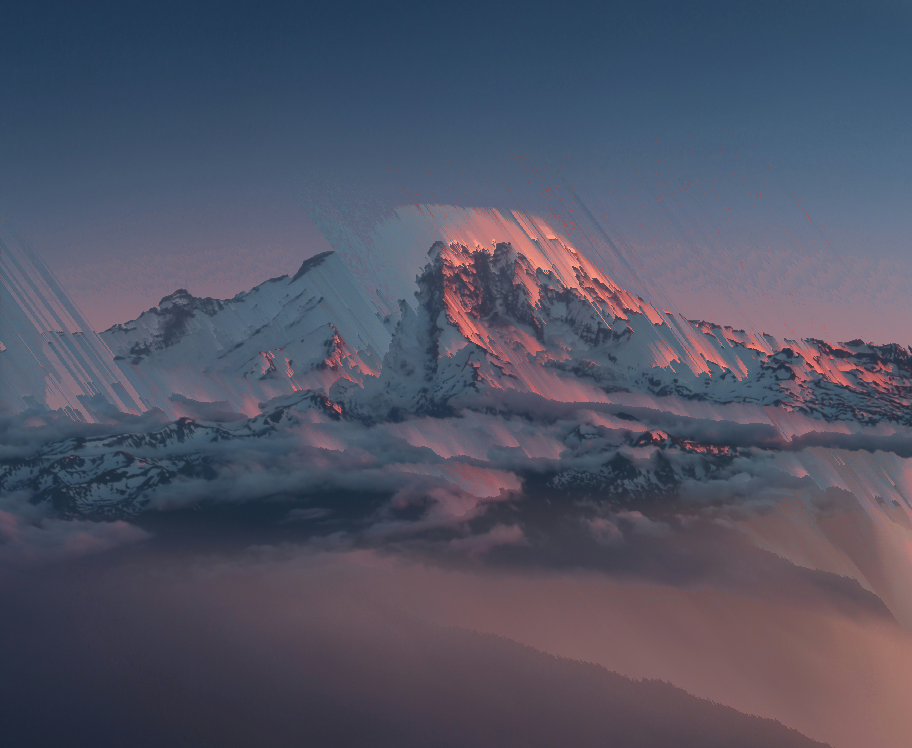

# Pixel Sorter
A graphics tool that modifies images by sorting images, leading to an interesting blur like effect.

## Usage
- Install the program
- Go to File > Open
- Use the file manager to find a .png or .jpg file you want to sort
- Modify sort settings
- Press the "Sort" Button
- Once you are happy with the results go to File > Export as and choose what you want the sorted image to be saved as (currently only exports to the png format)

## Controls
*All controls have tool tips when the cursor hovers over them.*
### Sorting
- Value: What value of each pixel should be sorted, including Hue, Saturation, and Value.
- Range Minimum: Choose the minimum value that will be sorted
- Range Maximum: Choose the maximum value that will be sorted
- Angle knob and slider: Change the angle of the line the pixels are sorted along.

### Magnifier
When the mouse cursor is over the original or sorted image, a small magnified view of the image will show up, with the view centered on the cursor.
- Pixels: The width and height of the zoomed in area are controlled by this.
- Size: This controls the size of the popup on the screen.

## Build Dependencies
SDL2 and SDL2 image, while this uses DearImGui, those files are included in this repository

Please note that for now, Windows is not supported. *I plan to add support in the future*

### License
This project is licensed under the BSD 3-Clause License
